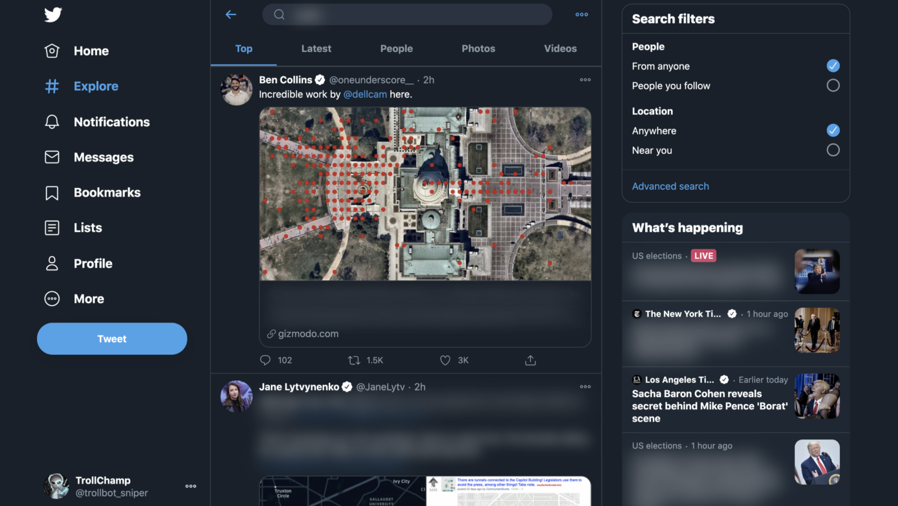

# Trollbot

#### A Chrome extension that uses the Botometer API to sort between human users and twitter bots as well as blur out certain words on the Twitter timeline/feed.



### Using the Blur Tool

Clone the repo, go to `chrome://extensions`, enable `Developer Mode`, and load the unpacked extension.

### To change what words get blurred, go into the content.js file and edit the array.

```
let word = [
    "corona",
    "covid",
    "covid-19",
    "covid19",
    "virus",
    "parler",
    "trump",
  ];
```

## Update: Botometer API integration currently unavailable. Working with Twitter Developer Account, come back soon!!!
